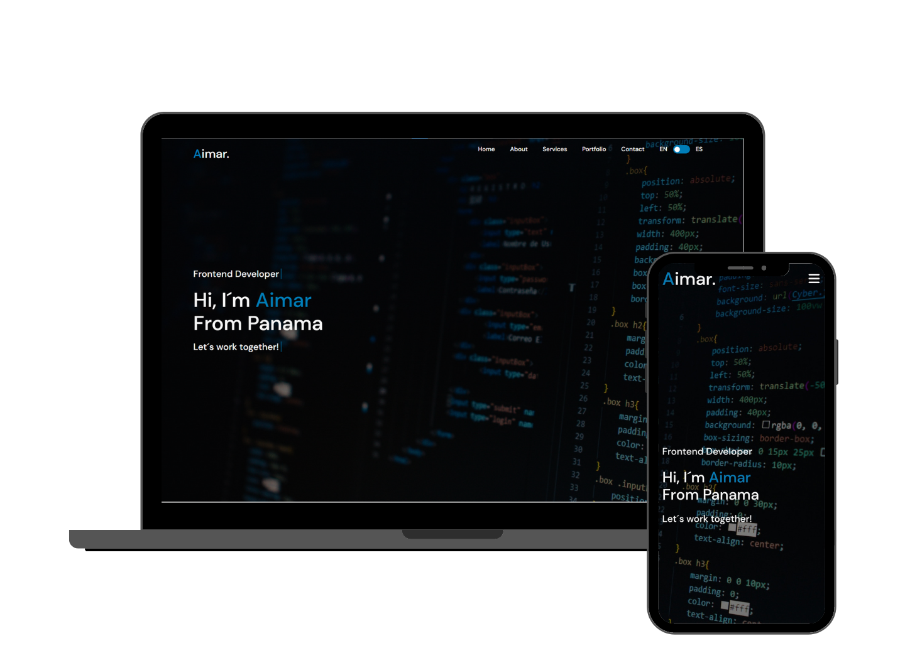

# Personal Portfolio

## Welcome

Welcome to my personal portfolio! Here you will find a showcase of my work and experience in the field of frontend development.

## About Me

I am a passionate Frontend developer with a focus on web development. With 2 years of experience, I have worked on a wide range of challenging and exciting projects. My goal is to create innovative and high-quality solutions that meet the needs of my clients.

## Skills

### Languajes

-   HTML
-   CSS
-   JavaScript
-   SASS

### Frameworks and Libraries

-   Bootstrap
-   React
-   Tailwind CSS

### No Code

-   WordPress
-   Elementor

### E-commerce

-   Shopify

## Color Reference

Below are the colors used in my portfolio:

-   `primaryColor: #121212`
-   `secondaryColor: #007DB8`
-   `thirdColor: #f7f7f7`
-   `fourthColor: #ababab`
-   `fifthColor: #262626`

## Contact

Feel free to reach out to me through the following channels:

-   [Portfolio](https://aimarbusta.netlify.app/)
-   [LinkedIn](https://www.linkedin.com/in/aimarbustamante/)
-   [GitHub](https://github.com/AimarBustamante)

I look forward to connecting with you and discussing potential collaborations or projects.
